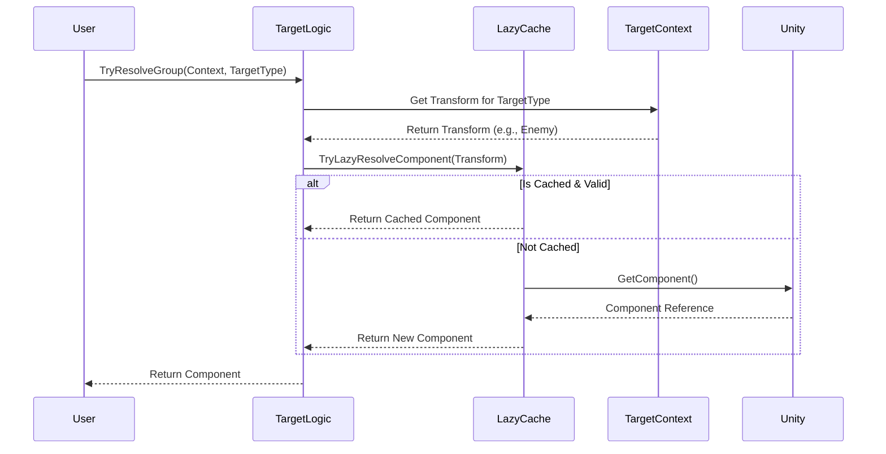

# AV.Lifetime


[](https://unity.com)
[](LICENSE.md)

Targeting context system with efficient lazy caching.

## ✨ Features

- **Target Context**: Centralized references for `Owner`, `Source`, `Target`, and Custom slots.
- **Lazy Resolution**: `TargetLogic` resolves components from targets only when needed.
- **Caching**: Minimizes `GetComponent` calls using `LazyCache`.

## 📦 Installation

Install via Unity Package Manager (git URL).

### Dependencies
- **AV.Unity.Extend**

## 🚀 Usage

```csharp
// 1. Define Context
var context = new TargetContext { Owner = transform, Target = enemy };

// 2. Resolve Component from Target (Cached)
if (TargetLogic.TryResolveGroup(transform, ref cache, context, ETarget.Target, out Health health))
{
    health.TakeDamage(10);
}
```

## ⚠️ Status

- 🧪 **Tests**: Missing.
- 📘 **Samples**: None.

## 🔍 Deep Dive

### Target Resolution Flow
How the system resolves a component from a target context efficiently.

